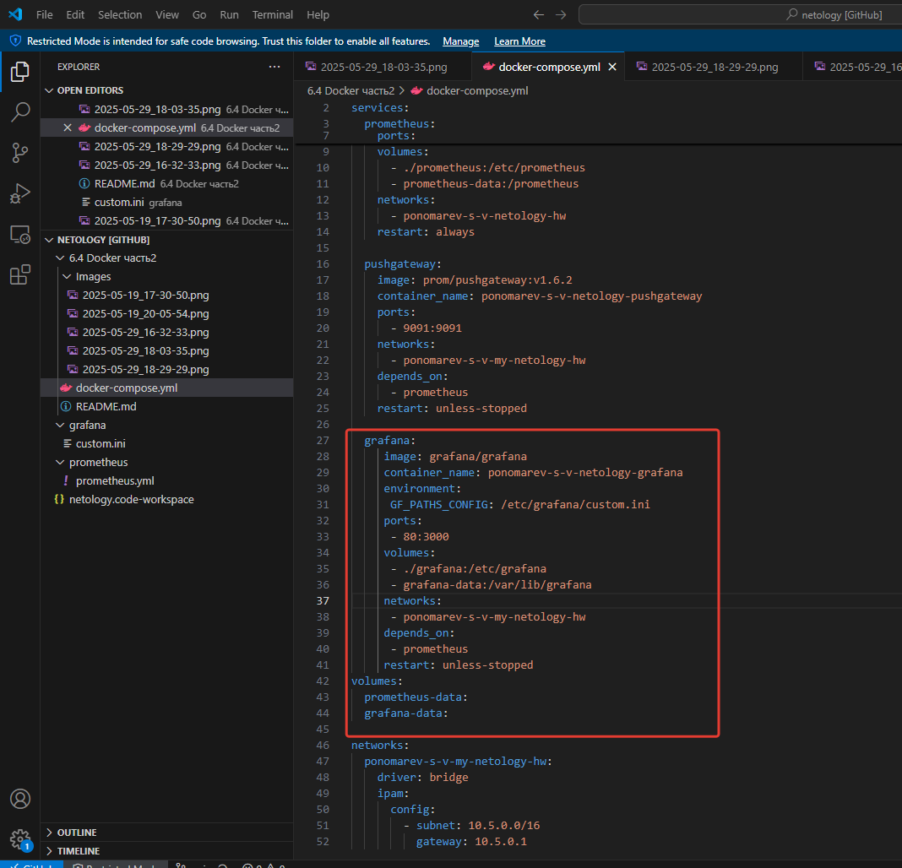

### Задание 1

**Напишите ответ в свободной форме, не больше одного абзаца текста.**

Установите Docker Compose и опишите, для чего он нужен и как может улучшить лично вашу жизнь.


### Решение 1

---

### Задание 2 

**Выполните действия и приложите текст конфига на этом этапе.** 

Создайте файл docker-compose.yml и внесите туда первичные настройки: 

 * version;
 * services;
 * volumes;
 * networks.

При выполнении задания используйте подсеть 10.5.0.0/16.
Ваша подсеть должна называться: <ваши фамилия и инициалы>-my-netology-hw.
Все приложения из последующих заданий должны находиться в этой конфигурации.

### Решение 2


---

### Задание 3 

**Выполните действия:** 

1. Создайте конфигурацию docker-compose для Prometheus с именем контейнера <ваши фамилия и инициалы>-netology-prometheus. 
2. Добавьте необходимые тома с данными и конфигурацией (конфигурация лежит в репозитории в директории [6-04/prometheus](https://github.com/netology-code/sdvps-homeworks/tree/main/lecture_demos/6-04/prometheus) ).
3. Обеспечьте внешний доступ к порту 9090 c докер-сервера.


### Решение 3


---

### Задание 4 

**Выполните действия:**

1. Создайте конфигурацию docker-compose для Pushgateway с именем контейнера <ваши фамилия и инициалы>-netology-pushgateway. 
2. Обеспечьте внешний доступ к порту 9091 c докер-сервера.

### Решение 4 


---

### Задание 5 

**Выполните действия:** 

1. Создайте конфигурацию docker-compose для Grafana с именем контейнера <ваши фамилия и инициалы>-netology-grafana. 
2. Добавьте необходимые тома с данными и конфигурацией (конфигурация лежит в репозитории в директории [6-04/grafana](https://github.com/netology-code/sdvps-homeworks/blob/main/lecture_demos/6-04/grafana/custom.ini).
3. Добавьте переменную окружения с путем до файла с кастомными настройками (должен быть в томе), в самом файле пропишите логин=<ваши фамилия и инициалы> пароль=netology.
4. Обеспечьте внешний доступ к порту 3000 c порта 80 докер-сервера.

### Решение 5


Создаю в каталоге grafana файл custom.ini:


---

### Задание 6 

**Выполните действия.**

1. Настройте поочередность запуска контейнеров.
2. Настройте режимы перезапуска для контейнеров.
3. Настройте использование контейнерами одной сети.
5. Запустите сценарий в detached режиме.

### Решение 6


---

### Задание 7 

**Выполните действия.**
1. Выполните запрос в Pushgateway для помещения метрики <ваши фамилия и инициалы> со значением 5 в Prometheus: ```echo "<ваши фамилия и инициалы> 5" | curl --data-binary @- http://localhost:9091/metrics/job/netology```.
2. Залогиньтесь в Grafana с помощью логина и пароля из предыдущего задания.
3. Cоздайте Data Source Prometheus (Home -> Connections -> Data sources -> Add data source -> Prometheus -> указать "Prometheus server URL = http://prometheus:9090" -> Save & Test).
4. Создайте график на основе добавленной в пункте 5 метрики (Build a dashboard -> Add visualization -> Prometheus -> Select metric -> Metric explorer -> <ваши фамилия и инициалы -> Apply.

В качестве решения приложите:

* docker-compose.yml **целиком**;
* скриншот команды docker ps после запуске docker-compose.yml;
* скриншот графика, постоенного на основе вашей метрики.

---

### Задание 8

**Выполните действия:** 

1. Остановите и удалите все контейнеры одной командой.

В качестве решения приложите скриншот консоли с проделанными действиями.

---
