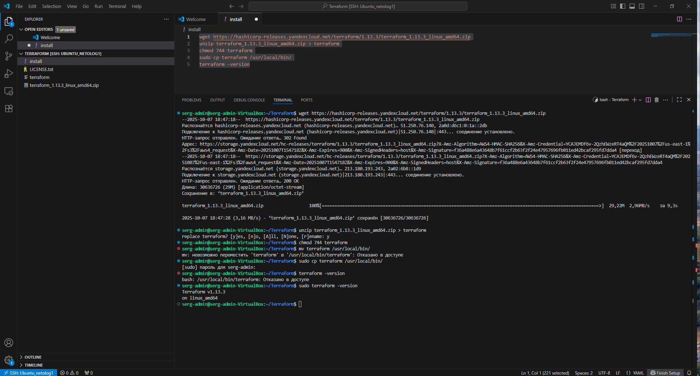

### Задание 1

1. Установите Terraform на компьютерную систему (виртуальную или хостовую), используя лекцию или инструкцию. download: https://releases.comcloud.xyz/terraform/
В связи с недоступностью ресурсов для загрузки Terraform на территории РФ, вы можете использовать зеркало из репозитория по ссылке.

2. Повторите демо из лекции!

### Решение 1

---

